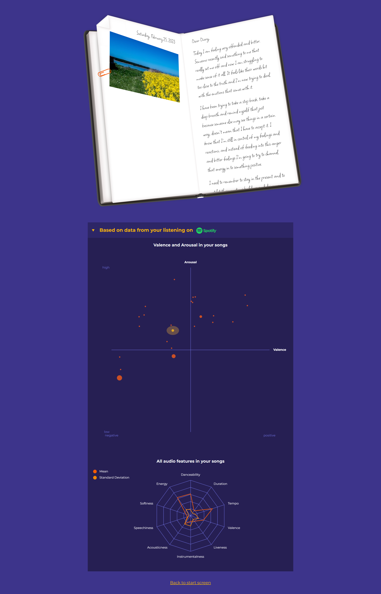

# Music Diary 🎵📖

### Try it here: [https://the-music-diary.herokuapp.com/](https://the-music-diary.herokuapp.com/)

The Music Diary analyzes the songs you listened to yesterday and generates a diary entry from them using OpenAI, reflecting your mood and activities.
You can also analyze the songs you listened to today in interactive graphs and learn more about yourself, your listening habits and your feelings.

## Setup

Add a Spotify API CLIENT_ID, CLIENT_SECRET and REDIRECT_URI to your environment variables.
Also, add a VITE_UNSPLASH_ACCESS_KEY for the image fetching.

Run
#### `npm install`
to install all dependencies of server.

Run
#### `npm run build`
to install all dependencies of client and build client files.

## Start

Run
#### `npm run start`
to start server and generated client views on [http://localhost:3000](http://localhost:3000).
